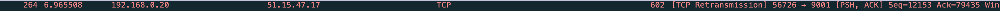

# TP4
## Sujet global : refresh

[Mise en place de la topo sur GNS3](./docs/topo.md)

### I/Configuration des admins, des guests et des vms

* Admins  
    * [admin 1](./docs/admin1.md)
    * [admin 2](./docs/admin2.md)
    * [admin 3](./docs/admin3.md)

* Guests  
    * [guest 1](./docs/guest1.md)
    * [guest 2](./docs/guest2.md)
    * [guest 3](./docs/guest3.md)

* VMs  
    * [VM web](./docs/vmweb.md)
    * [VM dns](./docs/vmdns.md)
    * [VM dhcp](./docs/vmdhcp.md)

### II/ Configuration des switchs et du routeur

* Switch  
    * [client-sw 1](./docs/clientsw1.md)
    * [client-sw 2](./docs/clientsw2.md)
    * [client-sw 3](./docs/clientsw3.md)
    * [infra-sw 1](./docs/infrasw1.md)

* Routeur  
    * [R1](./docs/r1.md)

### III/ Ping de vérification

* [Admin to Admin](./docs/pingAdmin.md)   
* [Guest to Guest](./docs/pingGuest.md)   
* [Admin to Guest](./docs/pingAdminGuest.md)   
* [web to dns](./docs/pingWebDns.md)   
* [web and dns to WAN](./docs/pingToWan.md)   

## Sujet 5 : Anonymat en ligne

### Proxy HTTP
* [🌞 Lancez Wireshark et observez le trafic émis lors d'un trafic utilisant un proxy HTTP, puis un proxy HTTPS.](./docs/WireSharkProxy.md)

### Tor
#### Connexion au web avec Tor
* [🌞 Lancez Wireshark et observez le trafic émis lors d'un trafic utilisant le Tor Browser, comparé à une connexion classique.](.docs/Tor.md)

On peut voir que mon host envoie bien une requête vers l'adresse du premier VPN du petit cadenas vert.

#### Hidden service Tor

Création du petit `.onion` : 

